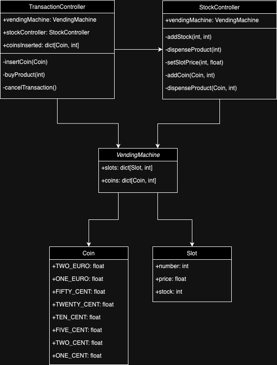

# Vending Machine
This application simulates a vending machine and its capable of simulating user interactions with it, including inserting coins, buying products and receiving change. The application also supports loading in products and coins to be available for dispensing.

To persist the state of the vending machine's stock, the application stores and retrieves data from a local database using SQLite.

# Features
- Add product stock into slots and coins inside the machine
- Manage quantity of products and price for each slot
- Insert specific coins by the user
- Buy a product with coins inserted
- Receive a product upon purchase and respective change
- Store and load machine data from local database
- Unit testing

## Project Structure
```plaintext
vending_machine/
├── main.py                               # Main entry point for application
├── models/              
│   ├── coin.py                           # Enum class for coins
│   ├── slot.py                           # Model class for machine slot
│   └── vending_machine.py                # Model class for vending machine
├── controllers/      
│   ├── transaction_controller.py         # Controller responsible for transaction interactions
│   └── stock_controller.py               # Controller responsible for machine stock interactions
├── data/              
│   └── db.py                             # Database functions
├── utils/ 
│   ├── constants.py                      # Code constants
│   └── initial_values.py                 # Initial values for machine
└── tests/
    ├── __init__.py
    ├── test_valyes.py                    # Test values used for testing
    ├── transaction_controller_test.py    # Tests for transaction controller
    └── stock_controller_test.py          # Tests for stock controller
```

## Usage
Navigate to the Project Directory
```plaintext
cd vendingmachine
```
Run main.py
```plaintext
python main.py
```
Follow on screen prompts to interact with the vending machine

Run tests by executing pytest
```plaintext
python -m pytest tests
```

## Class Diagram
